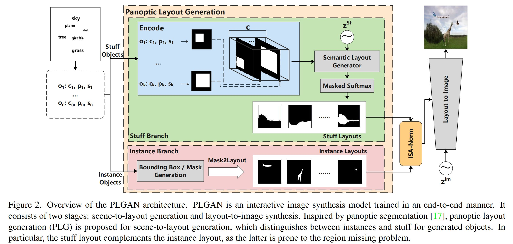
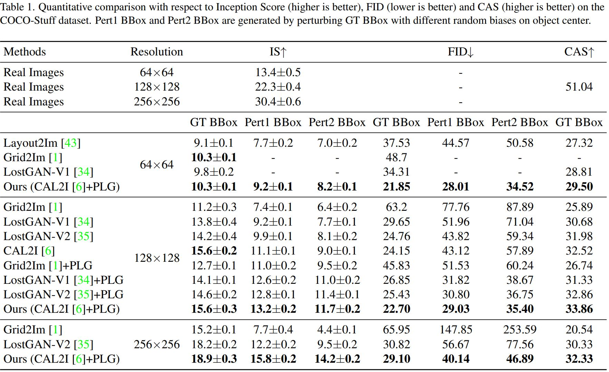
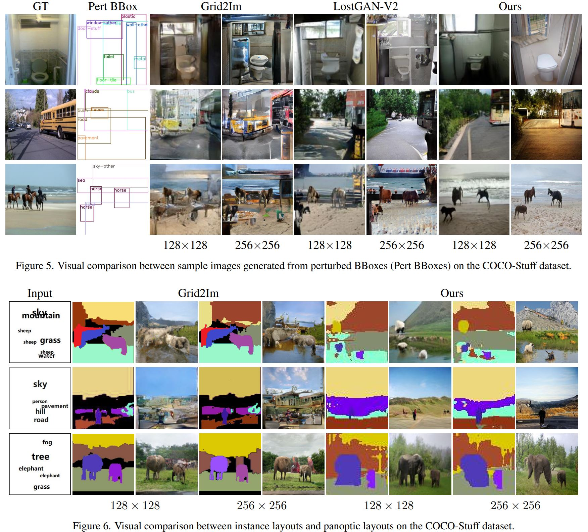

# PLGAN: Interactive Image Synthesis with Panoptic Layout Generation
This repository includes the implementation for [Interactive Image Synthesis with Panoptic Layout Generation](https://arxiv.org/abs/2203.02104) (to appear in CVPR 2022).



## Installation
#### 1. Requiements
* NVIDIA GPU, tested with V100
* python3
* pytorch == 1.2.0 
* imageio
```bash
pip install -r requirements.txt
```
#### 2. Setup roi_layers
```bash
python setup.py build develop
```

## GUI Demo

#### 1. Pretrained model
Download frozen model [plgan_256_frozen.pt](https://drive.google.com/drive/folders/1yzdjnBVQccADuerouZ9BUh9gEYaBcCV4?usp=sharing) 
or freeze pretrained model
```bash
CUDA_VISIBLE_DEVICES="0" python freeze.py \
    --dataset coco \
    --set val \
    --input_size 256 \
    --sample_path ./ \
    --model_path ${your_checkpoint_path} \
    --output_name ${frozen_model_name} \
    --sample_times 1
```

#### 2. Run
```
python src/simple_server.py --model_path ./plgan_256_frozen.pt
```
#### 3. Play with the GUI
Open "localhost:6006" in your browser. Zoom the webpage according to your screen size.

## Data Preparation
Download COCO dataset to `datasets/coco`
```
bash scripts/download_coco.sh
```
Download VG dataset to `datasets/vg`
```
bash scripts/download_vg.sh
python scripts/preprocess_vg.py
```

## Training
Our PLGAN leverages the state-of-the-art models, such as Grid2Im[1], LostGAN-V1[2], LostGAN-V2[3] and CAL2I[4], for layout-to-image synthesis.
Here, we support two versions of our PLGAN based on LostGAN-V2[3] and CAL2I[4].
```bash
# LostGAN-V2
CUDA_VISIBLE_DEVICES="0,1,2,3" python train_lostgan.py \
    --dataset coco \
    --data_dir ${your_data_directory} \
    --input_size 256 \
    --batch_size 32 \
    --workers 16 \
    --out_path ./models/plgan_lostgan_256_coco

# CAL2I
CUDA_VISIBLE_DEVICES="0,1,2,3" python train_cal2i.py \
    --dataset coco \
    --data_dir ${your_data_directory} \
    --input_size 256 \
    --batch_size 32 \
    --workers 16 \
    --out_path ./models/plgan_cal2i_256_coco
```

## Inference

```bash
# LostGAN-V2
CUDA_VISIBLE_DEVICES="0" python eval_lostgan.py \
    --dataset coco \
    --data_dir ${your_data_directory} \
    --set val \
    --input_size 256 \
    --sample_path ${your_checkpoint_path} \
    --model_path {} \
    --sample_times 5 \
    --gt_bb

# CAL2I
CUDA_VISIBLE_DEVICES="0" python eval_cal2i.py \
    --dataset coco \
    --data_dir ${your_data_directory} \
    --set val \
    --input_size 256 \
    --sample_path ${your_checkpoint_path} \
    --model_path {} \
    --sample_times 5 \
    --gt_bb
```
## Performance




## Reference
[1] Grid2Im: [https://github.com/ashual/scene_generation](https://github.com/ashual/scene_generation)

[2-3] LostGAN: [https://github.com/WillSuen/LostGANs](https://github.com/WillSuen/LostGANs)

[4] CAL2I: [https://github.com/wtliao/layout2img](https://github.com/wtliao/layout2img)

## Citation
If you find this code useful in your research then please cite
```
@article{wang2022interactive,
  title={Interactive Image Synthesis with Panoptic Layout Generation},
  author={Wang, Bo and Wu, Tao and Zhu, Minfeng and Du, Peng},
  booktitle={CVPR},
  year={2022}
}
```
